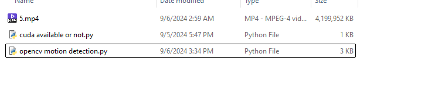
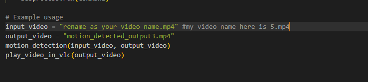
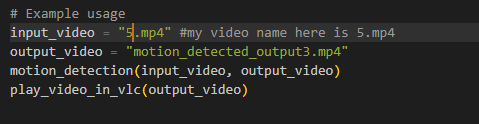
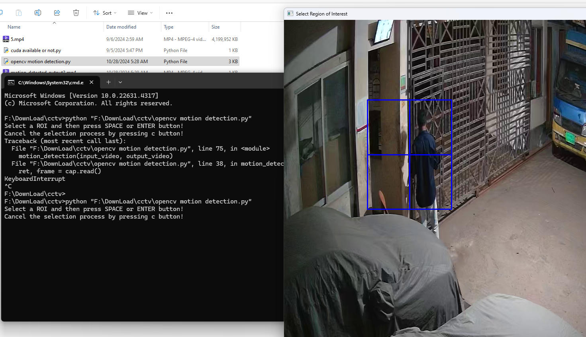

# Motion Detection in Specific Region of CCTV Footage

This project helps you detect motion in a specific region of interest (ROI) from a CCTV footage. You can easily customize the file path, select the region you want to monitor, and run the Python code for motion detection. Below is a quick tutorial on how to set up and run the project.

---

## Steps to Use:

### 1. **File Setup**
- Ensure that your video file is available in the same directory as the code.
  
  

### 2. **Modify the Code to Use Your File**
- In the code, change the file name to your video file's name. 
- Example: Rename the file in the code as `5.mp4`.

  

### 3. **Code Example After Renaming the File**
- Here's how the code should look after renaming the video file.
  
  

### 4. **Run the Application**
- Open the Python console using **Command Prompt** and run the Python script.
  
  ```bash
  python opencv_motion_detection.py
### 5. Select the Region of Interest (ROI)
Once the code is running, you will be prompted to select the region of interest in the video.
Select the area you want to monitor by clicking and dragging, then press Enter to start the motion detection.

  


Main Libraries:
OpenCV
NumPy

How It Works:
The user selects a region of the video.
The program detects motion in that region.
It highlights the parts of the video with detected motion and allows you to watch them at 2x speed.

License:
This project is open-source and available under the MIT License.

